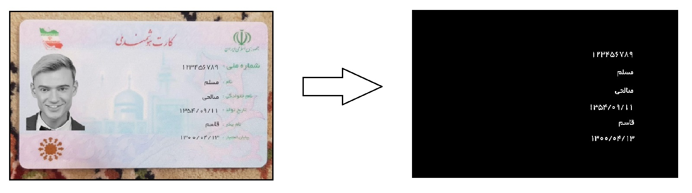

# OCR

This project is a simple OCR sistem using opencv, ArabicOcr, and pytesseract. You can extract personal information from **Persian** **Identity** **Card**. This is a perfect project for beginners as it is simple and covers the core principals of opencv, ArabicOcr, and pytesseract.

Requirements:

  - !pip install opencv-python-headless
  - !pip install ArabicOcr
  - !pip install pytesseract
  - !sudo apt-get install tesseract-ocr-fas

***

Extract binary information:

  - In this part extra data is deleted from the image and only the needed information is kept in a binary image.

Extract each part separately:

  - In this part the information which are not numbers are saved in seperate images.
 
Preprocessing numbers:

  - In this part the information which are numbers are analized.
  - Numbers are analized one by one and zeros and ones are recognized by image processing.
  - Slashs are deleted and numbers between them analized.

TEST:
  - In this part arabicocr and pytesseract are used for extracting rest of the information. At the end extracted information from this part and the information from image processing part are stuck together and reported as final result.

***

Links:

Colab: https://colab.research.google.com/drive/1-fsuPx4XUvnoy-ob_C2BrCvfApCzqO29?authuser=1#scrollTo=or3XSaorVnNt

Document Scanner: https://github.com/murtazahassan/Document-Scanner.git

Tesseract OCR: https://github.com/tesseract-ocr/tesseract.git
